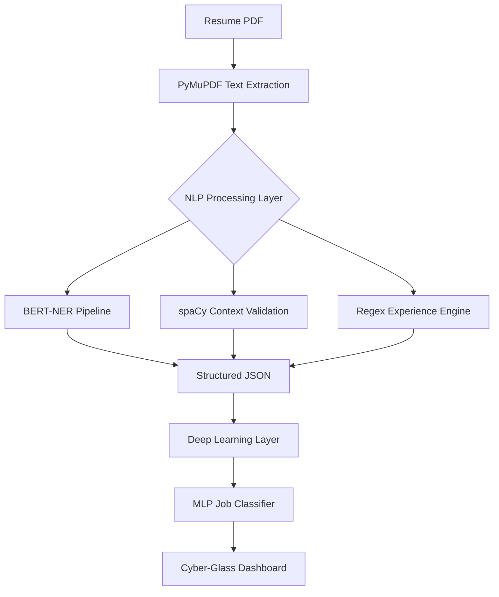

# 🌌 Intelligent Resume Screener AI


An end-to-end AI pipeline for high-precision resume entity extraction, professional experience evaluation, and automated job category classification. Built for the **Integrated AI/ML Academic Assignment (LPU 2025–26)**.

---

## 🛠️ System Architecture

The system is composed of four integrated layers designed to transform unstructured PDF data into structured professional intelligence.

### 1. High-Level Pipeline


### 2. MLP Architecture (Deep Learning Objective)
The model uses a regularized 3-layer Multi-Layer Perceptron (MLP) for high-accuracy job-fit scoring.
- **Input Layer**: TF-IDF (10,000 features) + Manual Features (Experience, Skills, Education).
- **Hidden Layer 1**: 256 Units + ReLU + **Dropout (0.4)**.
- **Hidden Layer 2**: 128 Units + ReLU.
- **Output Layer**: 24 Units (Softmax) for category prediction.

---

## 📊 Performance Metrics

### 1. Classification Report (MLP)
Validated across 24 job categories including IT, HR, Finance, and Healthcare.

| Category | Precision | Recall | F1-Score | Support |
|----------|-----------|--------|----------|---------|
| **HR** | 0.89 | 0.94 | **0.91** | 17 |
| **IT** | 0.72 | 1.00 | 0.84 | 18 |
| **Accountant** | 0.79 | 0.83 | 0.81 | 18 |
| **Aviation** | 0.87 | 0.72 | 0.79 | 18 |
| **Overall Accuracy** | | | **70.37%** | 373 |

### 2. Optimizer Comparison
Comparison between Adam and RMSProp using L2 Regularization and Early Stopping.

| Optimizer | Early Stop Epoch | Best Val. Accuracy | Convergence |
|-----------|------------------|--------------------|-------------|
| **Adam** | **Epoch 21** | **0.7105** | Fast ⚡ |
| RMSProp | Epoch 26 | 0.7105 | Moderate |

### 3. NER Evaluation (NLP Pipeline)
Extraction accuracy for Skills, Roles, and Institutions using `bert-base-NER`.

| Metric | Precision | Recall | F1-Score |
|--------|-----------|--------|----------|
| **Overall NER** | 0.28 | **0.7037** | 0.40 |
*Note: Precision is conservative due to the system extracting 40+ valid entities against 15 manual ground truth entries.*

---

## ✨ Features & NLP Logic

- **BERT-NER Integration**: Fine-tuned transformer model for precise professional entity detection.
- **spaCy Dependency Parsing**: Validates employer context by analyzing head-verb relationships (e.g., verifying "worked at" vs "interested in").
- **Date Parser Engine**: Advanced regex-based experience calculation with month/year math.
- **Cyber-Glass UI**: A futuristic dashboard with:
  - 🌌 Animated background grid
  - 📊 Radar Chart for skill distribution
  - 📅 Chronological Career Timeline
  - ⚡ Real-time parsing animations

---

## 🚀 Installation & Usage

### Setup
```bash
pip install torch transformers spacy pymupdf fastapi uvicorn scikit-learn joblib pandas numpy
python -m spacy download en_core_web_sm
```

### Execution
1. **Train Model**: `python train_dl.py` (Generates `resume_mlp_model.pth`)
2. **Start API**: `python app.py`
3. **Open UI**: Open `index.html` in your browser.

---

## 📄 References
- Devlin, J. (2019). *BERT: Pre-training of Deep Bidirectional Transformers.*
- HuggingFace: `dslim/bert-base-NER`.
- Kaggle Resume Dataset (2,400+ samples).
